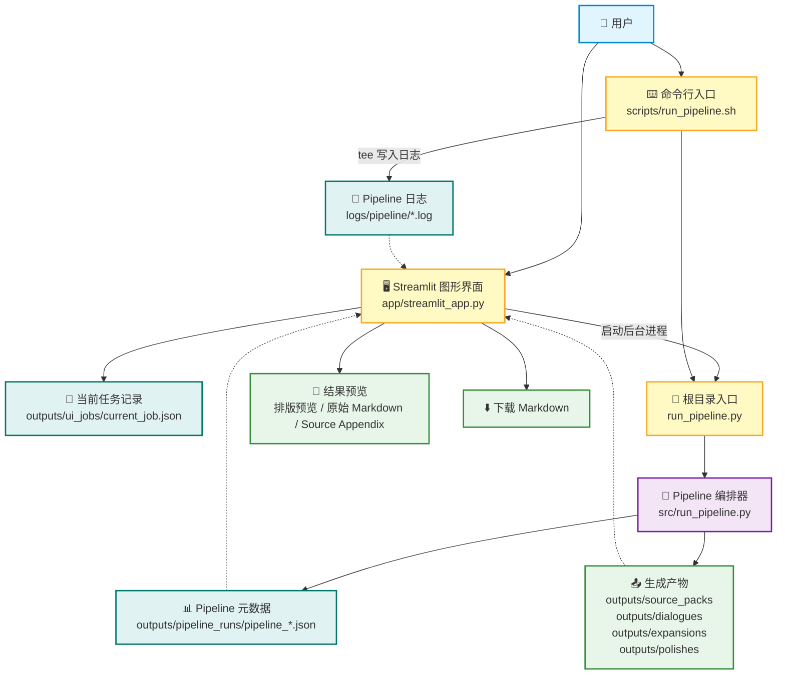
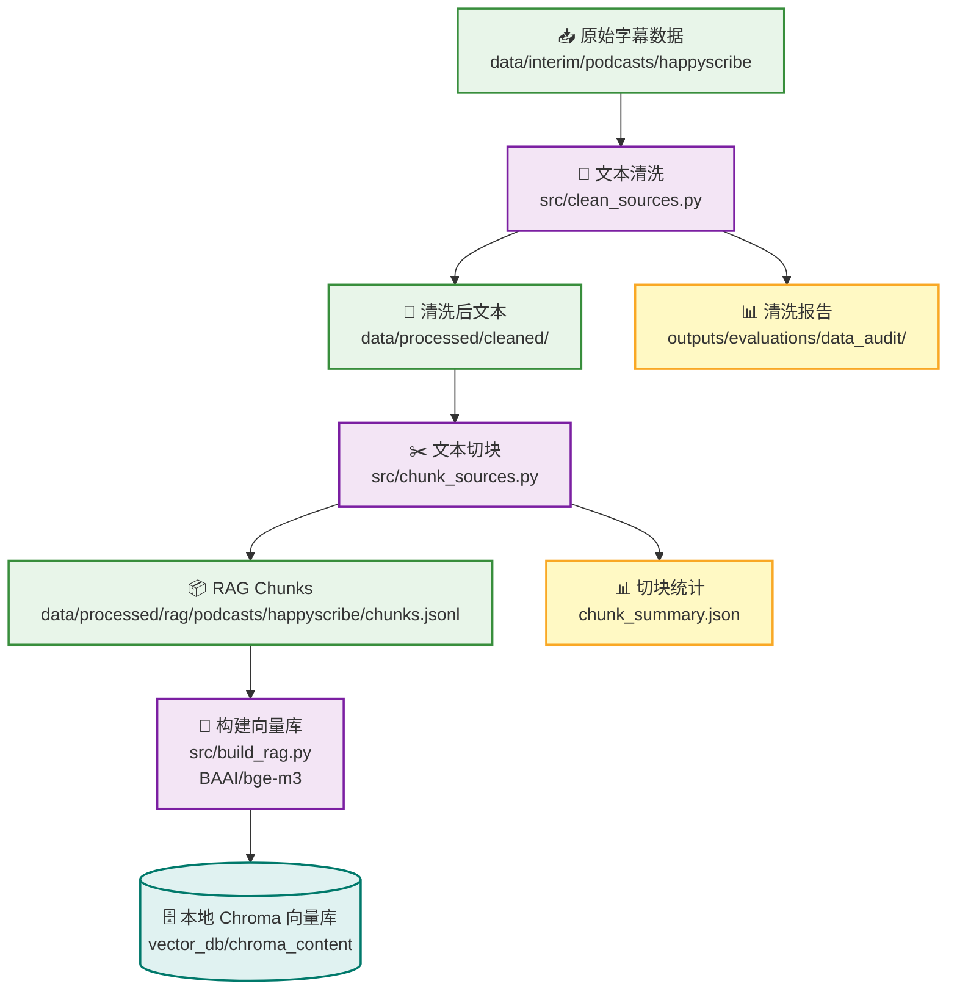
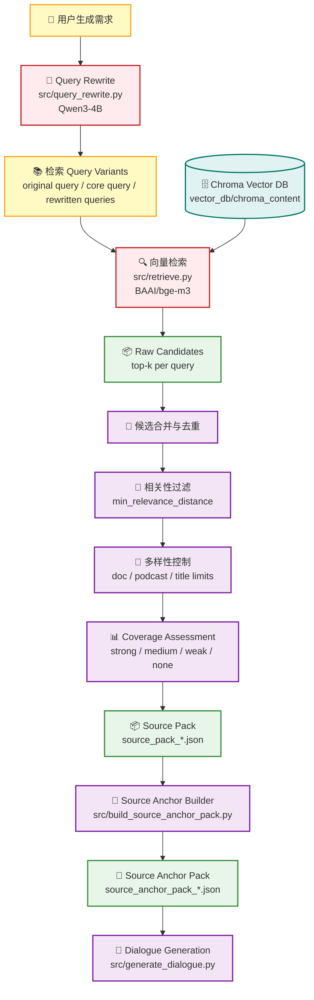
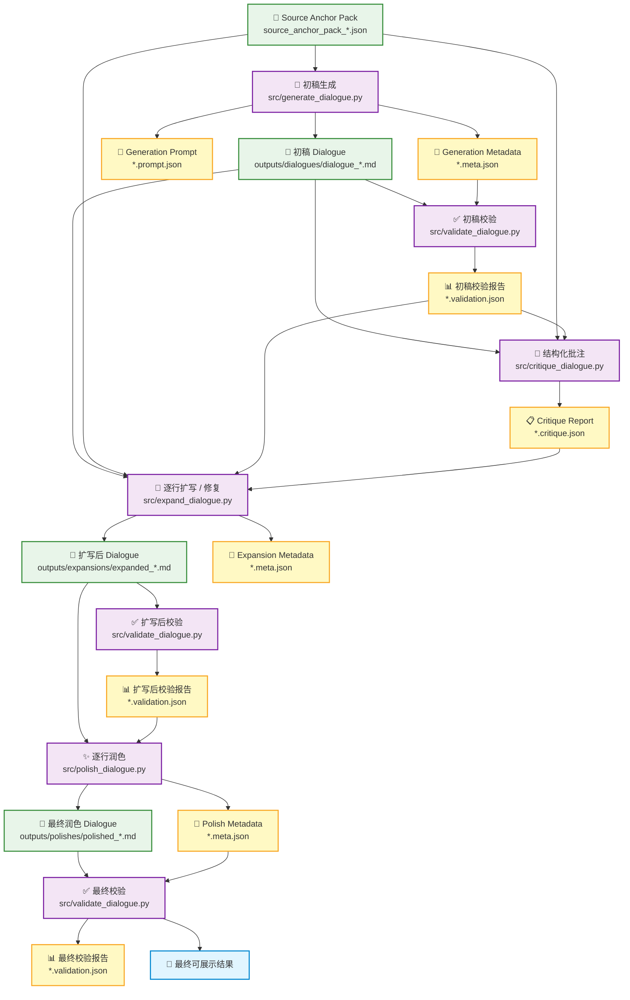
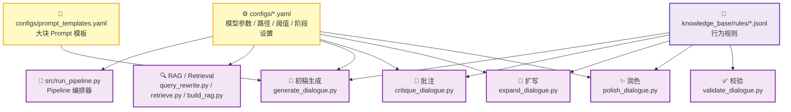
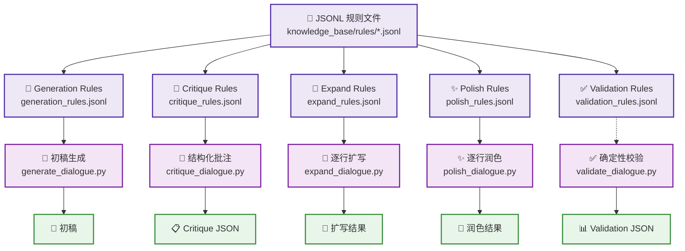

<p align="center">
  中文 | <a href="ARCHITECTURE_en.md">English</a>
</p>

# 🏗️ TTSDataGen 系统架构

本文档说明 TTSDataGen V0.2 的整体系统架构，包括运行入口、Streamlit UI 任务生命周期、本地 RAG 构建与检索流程、多阶段对话生成 pipeline、校验与元数据机制，以及配置和规则系统。

TTSDataGen 是一个本地优先的 RAG-to-dialogue 生成系统。它可以将用户输入的主题或生成需求，转换为 source-grounded（基于检索素材约束）的多轮中文 A/B 对话，用于 Text-to-Speech 训练数据构建。


## 目录

- [1. 系统总览](#1-系统总览)
- [2. 运行入口](#2-运行入口)
- [3. Streamlit UI 任务生命周期](#3-streamlit-ui-任务生命周期)
- [4. RAG 与素材准备层](#4-rag-与素材准备层)
- [5. 对话生成与多阶段优化层](#5-对话生成与多阶段优化层)
- [6. 校验、元数据与 UI 恢复机制](#6-校验元数据与-ui-恢复机制)
- [7. 配置、Prompt 与规则系统](#7-配置prompt-与规则系统)


---

## 1. 系统总览

从整体上看，TTSDataGen 包含五层：

```text
用户入口层
  → Streamlit UI / CLI

Pipeline 编排层
  → run_pipeline.py / src/run_pipeline.py

RAG 与素材准备层
  → query rewrite / Chroma retrieval / source pack / source anchor pack （素材锚点包）

生成与优化层
  → generate / validate / critique / expand / polish / final validate

产物与元数据层
  → markdown outputs / prompt JSON / validation JSON / pipeline run JSON / logs
```
---

## 2. 运行入口

TTSDataGen 目前有两个主要用户入口：Streamlit 图形界面和命令行脚本。  
二者都会通过根目录下的 `run_pipeline.py` 转发到同一个标准 pipeline 实现：`src/run_pipeline.py`。

```text
Streamlit 图形界面
  → app/streamlit_app.py

命令行封装脚本
  → scripts/run_pipeline.sh

根目录 Python 入口
  → run_pipeline.py

标准 Pipeline 编排器
  → src/run_pipeline.py
```

### 2.1 Streamlit 图形界面

```text
app/streamlit_app.py
```

Streamlit UI 是当前推荐的用户使用入口。

它主要负责：

- 收集用户输入的生成需求
- 选择 Draft / Full 运行模式
- 可选指定对话轮数
- 以后台子进程方式启动 pipeline
- 写入和读取 `outputs/ui_jobs/current_job.json`
- 记录当前任务的 PID
- 读取 `outputs/pipeline_runs/pipeline_*.json`
- 展示任务进度、运行日志、校验状态、素材匹配度和最佳可展示结果
- 允许用户取消正在运行的任务
- 允许用户下载最终生成的 Markdown 文件

需要注意的是，Streamlit UI 本身并不直接生成对话。它会调用根目录下的 `run_pipeline.py`，再由该入口转发到 `src.run_pipeline`，最终由标准 pipeline 编排器完成实际生成流程。

---

### 2.2 命令行封装脚本

```text
scripts/run_pipeline.sh
```

该 shell 脚本是主要的终端运行入口，适合开发、调试和直接从命令行运行 pipeline。

它主要负责：

- 切换到项目根目录
- 读取用户输入的 query
- 接收可选的 extra instructions
- 读取环境变量，例如 `PIPELINE_MODE`、`PIPELINE_MAX_EXPAND_RETRIES`、`PIPELINE_SKIP_POLISH` 和 `PIPELINE_SKIP_EXPAND`
- 将运行日志写入 `logs/pipeline/`
- 调用根目录下的 `run_pipeline.py`

示例：

```bash
bash scripts/run_pipeline.sh "生成30轮A与B对话，主题是早餐文化、家庭习惯和代际差异"
```

Draft 模式：

```bash
PIPELINE_MODE=draft bash scripts/run_pipeline.sh "生成12轮A与B对话，主题是火车旅行、陌生人和人生选择"
```

Full 模式是默认模式：

```bash
PIPELINE_MODE=full bash scripts/run_pipeline.sh "生成30轮A与B对话，主题是厨房气味、童年记忆和家庭聚会"
```

---

### 2.3 根目录 Python 入口

```text
run_pipeline.py
```

根目录下的 `run_pipeline.py` 是一个非常轻量的入口文件：

```python
from src.run_pipeline import main


if __name__ == "__main__":
    main()
```

它的作用是让 Streamlit UI 和命令行脚本都可以从项目根目录启动 pipeline，而不需要重复编写 orchestration 逻辑。

---

### 2.4 标准 Pipeline 编排器

```text
src/run_pipeline.py
```

这是项目真正的 workflow engine。

它负责维护完整的 pipeline contract，包括：

- 创建稳定的 `run_id`
- 预先规划所有输出路径
- 写入初始 `pipeline_*.json`
- 更新任务进度
- 调用检索、source anchor 构建、初稿生成、校验、批注、扩写、润色和最终校验
- 汇总每个阶段的结果到 `pipeline_meta["stages"]`
- 在失败或部分完成时选择 best available artifact
- 写入最终状态、错误信息、素材质量摘要、UI 展示摘要和最终输出路径

---

### 2.5 入口层架构图



---

## 3. Streamlit UI 任务生命周期

Streamlit UI 采用后台子进程运行 pipeline，而不是在页面主线程中直接阻塞执行。

整体流程如下：

```text
用户提交生成需求
  → Streamlit 创建 run_id
  → Streamlit 写入 current_job.json
  → Streamlit 以后台子进程启动 run_pipeline.py
  → src/run_pipeline.py 写入 pipeline_*.json
  → Streamlit 每隔几秒自动刷新
  → Streamlit 从 pipeline_*.json 读取 progress 和 display_artifact
  → 用户在页面中查看进度、日志、校验结果、素材匹配度和最终 Markdown
```

当前任务状态会保存在：

```text
outputs/ui_jobs/current_job.json
```

标准 pipeline 状态会保存在：

```text
outputs/pipeline_runs/pipeline_*.json
```

这样即使用户刷新页面、切换标签页，或临时离开 Streamlit 页面，UI 也可以通过本地任务文件和 pipeline metadata 恢复当前任务状态。

---

### 3.1 UI 恢复机制

Streamlit UI 会优先读取当前任务文件：

```text
outputs/ui_jobs/current_job.json
```

该文件记录：

```text
job_id
run_id
status
pid
query
mode
rounds
extra_instructions
log_path
pipeline_meta_path
```

随后 UI 会继续读取对应的：

```text
outputs/pipeline_runs/pipeline_*.json
```

并从中获取：

```text
progress
status
source_quality
display_artifact
ui_summary
stages
final
error
```

如果 pipeline 已经结束，UI 会以 `pipeline_meta` 中的状态为准，而不是单纯依赖后台进程 PID。

---

### 3.2 最佳可展示结果选择

UI 不会自行猜测应该展示哪个文件。  
最终应该展示哪个 Markdown，由 `src/run_pipeline.py` 写入 `display_artifact` 字段决定。

展示优先级如下：

```text
正式通过的最终结果
  → polished candidate
  → expanded candidate
  → generated draft
  → 没有可展示结果
```

这种设计可以保证：即使 Full pipeline 最终没有完全通过质量校验，只要中间阶段已经生成了可检查的 Markdown，用户仍然可以在 UI 中查看、下载或人工判断该候选结果。

---

### 3.3 UI 展示内容

Streamlit UI 会展示：

- 当前任务 ID
- 运行状态
- Draft / Full 模式
- 任务进度
- 运行日志
- 素材匹配度
- 校验结果
- 当前展示版本
- Dialogue 预览
- 原始 Markdown
- Source Appendix
- Markdown 下载按钮

其中 Dialogue 输出会被拆分为三个视图：

```text
排版预览
原始 Markdown
Source Appendix
```

这样用户既可以直接阅读最终结果，也可以检查 source appendix 和原始 markdown 格式。

---

## 4. RAG 与素材准备层

TTSDataGen 的 RAG 层分为两部分：

```text
离线数据构建流程
  → 清洗原始文本
  → 切分为 RAG chunks
  → 生成 embeddings
  → 写入本地 Chroma 向量数据库

运行时检索流程
  → 改写用户 query
  → 从 Chroma 检索相关 chunks
  → 生成 source pack
  → 筛选 source anchors
  → 交给 dialogue generation 阶段
```

这种设计的好处是：大规模数据处理和向量库构建只需要提前完成一次；用户每次生成对话时，只需要执行轻量的 query rewrite、retrieval 和 source anchor selection。

---

### 4.1 离线数据构建流程

离线数据构建流程负责把原始 transcript 数据转换成本地可检索的 Chroma 向量数据库。



---

### 4.2 文本清洗：`src/clean_sources.py`

```text
src/clean_sources.py
```

该模块负责清洗 HappyScribe 抓取下来的 transcript 数据。

输入：

```text
data/interim/podcasts/happyscribe/<podcast_slug>/source_documents.jsonl
```

输出：

```text
data/processed/cleaned/podcasts/happyscribe/<podcast_slug>/source_documents_clean.jsonl
```

主要功能包括：

- 清洗 HappyScribe transcript 中的噪声文本
- 过滤清洗后过短的 documents
- 使用 cleaned text hash 去重
- 保留原始 metadata 和 cleaning stats
- 输出清洗报告，方便审计数据质量

清洗报告会写入：

```text
outputs/evaluations/data_audit/happyscribe/cleaning/
```

包括：

```text
summary.json
skipped_documents.jsonl
shortest_cleaned_documents.jsonl
largest_reduction_documents.jsonl
podcast_cleaning_counts.jsonl
```

---

### 4.3 文本切块：`src/chunk_sources.py`

```text
src/chunk_sources.py
```

该模块负责把清洗后的 transcript 切分成适合 RAG 检索的 chunks。

输入：

```text
data/processed/cleaned/podcasts/happyscribe/
```

输出：

```text
data/processed/rag/podcasts/happyscribe/chunks.jsonl
```

切块逻辑包括：

- 优先识别 timestamp block
- 如果没有可靠 timestamp，则退回到 paragraph-based splitting
- 控制 chunk 长度
- 支持 block overlap
- 合并或过滤过短 chunk
- 为每个 chunk 写入稳定的 `chunk_id`
- 保留 `doc_id`、`podcast_slug`、`title`、`url`、timestamp、char count 等 metadata
- 生成 `chunk_content_hash` 用于后续去重和审计

默认切块参数包括：

```text
target_chars = 2800
max_chars = 3600
min_chunk_chars = 400
overlap_blocks = 1
```

该阶段还会输出 chunk summary，用于检查 chunk 数量、长度分布、timestamp-aware documents 数量和重复 chunk hash 数量。

---

### 4.4 构建向量库：`src/build_rag.py`

```text
src/build_rag.py
```

该模块负责读取 `chunks.jsonl`，使用本地 embedding 模型生成向量，并写入 Chroma 向量数据库。

输入：

```text
data/processed/rag/podcasts/happyscribe/chunks.jsonl
```

输出：

```text
vector_db/chroma_content/
```

主要功能包括：

- 读取 RAG chunks
- 使用 `BAAI/bge-m3` 生成 dense embeddings
- 写入本地 Chroma collection
- 支持 batch embedding
- 支持 `max_chunks` 和 `start_offset`
- 支持跳过已经存在的 chunk ids
- 支持 `--reset` 重建 collection
- 记录 `total_seen`、`total_added`、`total_skipped_existing` 和 `collection_count`

默认向量库配置来自：

```text
configs/rag.yaml
```

常见配置包括：

```text
embedding model
batch size
max length
persist_dir
collection_name
distance metric
```

---

### 4.5 运行时检索流程

运行时检索流程发生在用户提交生成请求之后。  
它不重新构建向量库，而是使用已经准备好的 Chroma 数据库进行检索。



---

### 4.6 Query Rewrite：`src/query_rewrite.py`

```text
src/query_rewrite.py
```

该模块负责把用户输入改写成更适合本地 RAG 检索的 query。

它的目标不是生成最终内容，而是帮助系统从本地 podcast transcript 数据库中找到更相关的 source chunks。

输出结构包括：

```json
{
  "canonical_terms": [],
  "core_query": "",
  "retrieval_queries": [],
  "rewrite_used": true
}
```

主要设计包括：

- 使用 LM Studio 调用本地 Qwen3-4B
- 将中文或混合语言需求转换成英文检索 query
- 区分内容主题和生成格式要求
- 避免把“生成30轮对话”等格式要求带入检索
- 使用 topic consistency sanitizer 防止 query rewrite 偏题
- 支持 query rewrite cache
- 如果改写失败，可以 fallback 到用户原始 query

cache 默认写入：

```text
outputs/source_packs/query_rewrite_cache.jsonl
```

---

### 4.7 Source Pack：`src/retrieve.py`

```text
src/retrieve.py
```

该模块负责从本地 Chroma 向量库中检索 source chunks，并输出 source pack。

Source pack 包含：

```text
user_query
query_rewrite
retrieval_params
coverage
sources
```

其中 `sources` 会保留：

```text
rank
distance
chunk_id
doc_id
title
podcast_slug
url
timestamp
chunk_index
matched_queries
text
```

该阶段还会进行：

- 多 query 检索
- raw top-k 检索
- duplicate candidate merging
- content hash 去重
- 每个 doc / podcast / title 的数量限制
- relevance threshold filtering
- coverage assessment

Source pack 是后续 source anchor selection 的输入。

---

### 4.8 Source Anchor Pack：`src/build_source_anchor_pack.py`

```text
src/build_source_anchor_pack.py
```

该模块负责把 source pack 转换成更紧凑、更适合生成 prompt 使用的 source anchor pack。

它不会简单地把完整 chunks 全部塞进 prompt，而是会：

- 从用户 query 和 query rewrite 中构建 query profile
- 区分 strong terms、support terms 和 weak terms
- 识别 topic axes
- 清理 source text 中的广告、推广和 podcast 噪声
- 对句子进行 topic evidence scoring
- 按句子级别挑选相关 excerpt
- 判断 anchor role：`core`、`supporting` 或 `context`
- 拒绝弱相关、广告化、噪声过高或 topic evidence 不足的 source
- 使用 diversity filter 控制同一 doc / podcast 的重复占比
- 输出 selected anchors、unused accepted candidates 和 rejected candidates

输出文件：

```text
outputs/source_packs/source_anchor_pack_*.json
outputs/source_packs/latest_source_anchor_pack.json
```

Source Anchor Pack 是生成阶段真正依赖的主要 source material。  
它的目标是降低 prompt 噪声，让 `generate_dialogue.py` 优先使用更可靠、更具体、更贴近主题的素材。

---

### 4.9 RAG 相关模块职责表

| 模块 | 类型 | 主要职责 | 典型输出 |
|---|---|---|---|
| `src/clean_sources.py` | 离线数据处理 | 清洗 transcript、去重、过滤过短内容、输出审计报告 | `source_documents_clean.jsonl` |
| `src/chunk_sources.py` | 离线数据处理 | 将清洗文本切分为 RAG chunks，并保留 metadata | `chunks.jsonl` |
| `src/build_rag.py` | 离线向量库构建 | 使用 BGE-M3 生成 embeddings，并写入 Chroma | `vector_db/chroma_content/` |
| `src/query_rewrite.py` | 运行时检索准备 | 将用户需求改写为 retrieval queries，并防止主题漂移 | `query_rewrite` object |
| `src/retrieve.py` | 运行时检索 | 从 Chroma 检索 source chunks，去重、过滤并评估 coverage | `source_pack_*.json` |
| `src/build_source_anchor_pack.py` | 运行时素材压缩 | 从 source pack 中筛选高价值 source anchors | `source_anchor_pack_*.json` |

---

## 5. 对话生成与多阶段优化层

TTSDataGen 的生成层不是一次性调用大模型完成全部工作，而是把生成、检查、批注、扩写和润色拆成多个职责明确的阶段。

整体流程如下：

```text
Source Anchor Pack
  → 初稿生成
  → 初稿校验
  → 批注分析
  → 逐行扩写
  → 扩写后校验
  → 逐行润色
  → 最终校验
```

这种设计的目标是让每个模块只负责一类问题：

```text
generate_dialogue.py    → 生成 source-grounded 初稿
validate_dialogue.py    → 做确定性结构与质量检查
critique_dialogue.py    → 找出内容、结构、素材使用和风格问题
expand_dialogue.py      → 扩写薄弱行，修复批注指出的问题
polish_dialogue.py      → 局部润色中文表达，不新增事实
validate_dialogue.py    → 最终确认结果是否可用
```

---

### 5.1 生成与优化架构图



---

### 5.2 初稿生成：`src/generate_dialogue.py`

```text
src/generate_dialogue.py
```

该模块负责根据 `source_anchor_pack` 生成第一版 A/B 对话。

输入：

```text
source_pack_*.json
source_anchor_pack_*.json
configs/generation.yaml
configs/prompt_templates.yaml
knowledge_base/rules/generation_rules.jsonl
```

输出：

```text
outputs/dialogues/dialogue_*.md
outputs/dialogues/dialogue_*.meta.json
outputs/dialogues/dialogue_*.prompt.json
```

主要职责：

- 读取 `source_pack` 和 `source_anchor_pack`
- 校验 source anchor pack 是否存在可用 anchors
- 检查 source pack 和 source anchor pack 是否匹配当前 query
- 根据用户 query 自动识别轮数
- 加载 generation rules
- 构建 generation quality contract
- 将 source anchors 压缩成 prompt 可用格式
- 调用 LM Studio 本地模型生成初稿
- 删除模型可能自行生成的 source notes
- 由 Python 确定性追加 `Source Appendix`
- 写出 dialogue markdown、prompt JSON 和 metadata JSON

其中 `Source Appendix` （素材附录）不是模型自由生成的，而是由代码根据 source anchor pack 确定性写入。这样可以避免模型在正文里乱编引用或 source 信息。

---

### 5.3 确定性校验：`src/validate_dialogue.py`

```text
src/validate_dialogue.py
```

该模块不调用大模型，而是对 Markdown 输出做确定性检查。

它会检查：

```text
轮数
A/B 行数
编号是否连续
A/B speaker 是否交替
Round heading 与 dialogue line 是否匹配
Source Appendix 是否存在
对话正文是否泄露 source / retrieval / metadata 信息
是否存在重复 dialogue line
短句比例
充分展开句比例
```

默认质量阈值包括：

```text
short_line_chars = 50
developed_line_chars = 90
max_short_line_ratio = 0.35
min_developed_line_ratio = 0.50
```

校验结果会区分两层：

```text
mechanical_passed
  → 格式、编号、A/B 结构、Source Appendix、泄露检查等是否通过

quality_passed
  → 在 mechanical_passed 的基础上，内容密度和重复度是否也通过
```

因此：

```text
passed = mechanical_passed
quality_passed = mechanical_passed 且没有质量阻断 warning
needs_rewrite = mechanical_passed 但存在质量阻断 warning
```

这让 pipeline 可以区分“格式坏了”和“格式没坏但质量还需要扩写”。

---

### 5.4 结构化批注：`src/critique_dialogue.py`

```text
src/critique_dialogue.py
```

该模块负责批注初稿问题，但不直接改写对话。

输入：

```text
dialogue markdown
source_anchor_pack_*.json
validation report
configs/critic.yaml
knowledge_base/rules/critique_rules.jsonl
```

输出：

```text
dialogue_*.critique.json
dialogue_*.critique.prompt.json
```

主要职责：

- 分离 dialogue body 和 Source Appendix
- 压缩 validation report
- 压缩 source anchor pack
- 加载 critique rules
- 构建严格 JSON 输出的批注 prompt
- 调用 LM Studio 本地模型
- 解析模型返回的 critique JSON
- 如果模型返回非 JSON，则写入 fallback parse error report

批注结果会包含：

```text
overall_score
ready_for_rewrite
mechanical_status
quality_status
source_usage
dialogue_quality
major_issues
rewrite_priorities
rewrite_constraints
```

该阶段的目的不是“写得更好看”，而是为后续 `expand_dialogue.py` 提供明确的修复方向。

---

### 5.5 逐行扩写与修复：`src/expand_dialogue.py`

```text
src/expand_dialogue.py
```

该模块是质量提升的核心阶段。它不会重写整篇对话，而是根据 validation 和 critique 选择需要扩写或修复的 speaker lines。

输入：

```text
dialogue markdown
source_anchor_pack_*.json
validation report
critique report
configs/expander.yaml
knowledge_base/rules/expand_rules.jsonl
```

输出：

```text
outputs/expansions/expanded_*.md
outputs/expansions/expanded_*.meta.json
outputs/expansions/expanded_*.prompt.json
```

主要职责：

- 解析 numbered A/B speaker lines
- 根据 validation report 判断哪些 line 低于 developed threshold
- 根据 critique report 找到需要修复的问题内容
- 排除 critic 标记为 awkward / forced / off-context 的 source anchors
- 将目标 speaker lines 分 batch 发送给本地模型
- 要求模型只返回 JSON replacements
- 只替换指定行，不增加、不删除、不合并、不重排行
- 对 replacement 做格式清洗和长度检查
- 保留或重新生成 Source Appendix
- 写出扩写结果和详细 batch metadata

扩写阶段的边界是：

```text
可以增加内容密度
可以补充 source-grounded 细节
可以修复 critic 指出的问题
不能改变 A/B 编号结构
不能泄露 source / anchor / retrieval 信息
不能把对话改成说明文
```

---

### 5.6 逐行润色：`src/polish_dialogue.py`

```text
src/polish_dialogue.py
```

该模块负责最后的中文表达优化。它是 source-free 阶段，不再读取 source anchors，也不应该新增事实。

输入：

```text
expanded dialogue markdown
validation report
configs/polisher.yaml
knowledge_base/rules/polish_rules.jsonl
```

输出：

```text
outputs/polishes/polished_*.md
outputs/polishes/polished_*.meta.json
outputs/polishes/polished_*.prompt.json
```

主要职责：

- 解析 dialogue body 和 Source Appendix
- 解析 numbered A/B speaker lines
- 加载 polish rules
- 按 batch 对 speaker lines 做局部润色
- 要求模型只返回 JSON replacements
- 只替换需要润色的行
- 保持 line number、speaker label 和整体结构不变
- 使用 length guard 防止润色阶段过度缩短或过度扩写
- 保留原始 Source Appendix
- 写出 polished markdown 和 metadata

润色阶段的边界是：

```text
可以改善中文流畅度
可以减少翻译腔
可以减少重复开头
可以改善口语朗读感
不能新增事实
不能引入新 source
不能进行 source-grounded expansion
不能改变对话结构
```

---

### 5.7 模块职责表

| 模块 | 阶段类型 | 是否调用 LLM | 是否使用 source anchors | 是否修改 dialogue | 主要输出 |
|---|---|---:|---:|---:|---|
| `src/generate_dialogue.py` | 初稿生成 | 是 | 是 | 生成全文 | `outputs/dialogues/dialogue_*.md` |
| `src/validate_dialogue.py` | 确定性校验 | 否 | 否 | 否 | `*.validation.json` |
| `src/critique_dialogue.py` | 结构化批注 | 是 | 是 | 否 | `*.critique.json` |
| `src/expand_dialogue.py` | 逐行扩写 / 修复 | 是 | 是 | 是，逐行替换 | `outputs/expansions/expanded_*.md` |
| `src/polish_dialogue.py` | 逐行润色 | 是 | 否 | 是，逐行替换 | `outputs/polishes/polished_*.md` |
| `src/validate_dialogue.py` | 最终校验 | 否 | 否 | 否 | `*.validation.json` |

---

### 5.8 为什么要拆成多阶段

这种多阶段设计有几个好处：

1. **生成和修复分离**  
   初稿生成只负责把 source anchors 转成完整 A/B 对话，不要求一次性解决所有质量问题。

2. **质量问题可定位**  
   Validation 负责机械结构和内容密度检查，Critique 负责更语义化的质量诊断。

3. **扩写更可控**  
   Expansion 只改目标行，不重写全文，因此更容易保持轮数、编号和 A/B 结构稳定。

4. **润色不污染事实**  
   Polish 是 source-free 阶段，只做表达层面的局部优化，不再新增事实或引入外部信息。

5. **每一步都有 artifact**  
   每个阶段都会保存 `.md`、`.meta.json`、`.prompt.json` 或 `.validation.json`，方便调试、回溯和 UI 展示。

---

## 6. 校验、元数据与 UI 恢复机制

TTSDataGen 在每个关键阶段都会写出结构化 metadata，方便调试、恢复和 UI 展示。

主运行记录文件位于：

```text
outputs/pipeline_runs/pipeline_*.json
```

该文件记录：

```text
pipeline status
progress
config paths
output paths
stage summaries
validation summaries
critique summaries
source quality summary
display artifact
ui summary
final result
error message
```

---

### 6.1 Validation 的两层判断

`src/validate_dialogue.py` 会区分两类结果：

```text
mechanical_passed
quality_passed
```

其中：

```text
mechanical_passed
  → 是否存在结构性错误，例如轮数错误、A/B 编号错误、speaker 交替错误、Source Appendix 缺失、正文泄露 source/retrieval 信息等

quality_passed
  → 在 mechanical_passed 通过的基础上，是否还通过内容密度和重复度检查
```

因此，一个 dialogue 可能出现三种状态：

```text
failed_mechanical
  → 结构错误，通常不能作为可用输出

needs_rewrite
  → 结构通过，但内容密度或重复度不足，需要扩写或修复

passed
  → 结构和质量检查都通过
```

---

### 6.2 Pipeline metadata

每次 pipeline run 都会写入：

```text
outputs/pipeline_runs/pipeline_*.json
```

它是 Streamlit UI 和命令行调试的核心状态文件。

常见字段包括：

```text
run_id
query
mode
status
progress
paths
stages
source_quality
display_artifact
ui_summary
final
error
started_at
finished_at
```

---

### 6.3 最佳可展示结果

即使 Full pipeline 没有完全成功，系统也会尽量选择一个 best available artifact 给 UI 展示。

优先级如下：

```text
正式通过的最终润色结果
  → polished candidate
  → expanded candidate
  → generated draft
  → 没有可展示结果
```

这样 Streamlit UI 不需要自己猜测应该显示哪个文件，只需要读取 `pipeline_meta["display_artifact"]` 即可。

---

### 6.4 为什么需要这些 metadata

这些 metadata 主要用于：

- 页面刷新后的任务恢复
- 后台任务状态追踪
- 显示当前进度
- 展示日志和错误
- 判断最终结果是否可下载
- 判断素材匹配质量
- 比较 generated / expanded / polished 不同阶段的质量
- 调试 prompt、rules 和 validation thresholds

---

## 7. 配置、Prompt 与规则系统

TTSDataGen 将模型参数、Prompt 模板和行为规则尽量从 Python 代码中拆出来，放在独立的配置文件和规则文件中。

这样做的目标是：

```text
Python 代码负责流程和结构
configs/*.yaml 负责模型参数、路径和阶段配置
prompt_templates.yaml 负责大块 Prompt 模板
knowledge_base/rules/*.jsonl 负责可持续迭代的行为规则
```

这种设计可以避免频繁修改核心代码，也方便后续根据生成效果调整不同阶段的行为。

---

### 7.1 配置系统总览



---

### 7.2 Config files

配置文件位于：

```text
configs/
```

主要文件包括：

| 文件 | 作用 | 主要控制内容 |
|---|---|---|
| `configs/rag.yaml` | RAG 与检索配置 | embedding 模型、Chroma 路径、collection 名称、query rewrite、top-k、距离阈值、多样性限制 |
| `configs/generation.yaml` | 初稿生成配置 | generator 模型、source anchor 阈值、默认轮数、输出目录、generation rules 路径 |
| `configs/critic.yaml` | 批注配置 | critic 模型、temperature、max tokens、critique rules 路径 |
| `configs/expander.yaml` | 扩写配置 | expander 模型、输出目录、expand rules、扩写阶段 prompt 边界 |
| `configs/polisher.yaml` | 润色配置 | polisher 模型、输出目录、polish rules、润色阶段 prompt 边界 |
| `configs/prompt_templates.yaml` | Prompt 模板 | 初稿生成阶段的大块 system prompt 和 user template |

这些配置文件主要控制：

```text
模型名称
LM Studio API 地址
temperature / top_p / max_tokens
输入输出路径
RAG 检索参数
Source Anchor 筛选阈值
每个阶段加载哪些 rules
Prompt 模板路径
```

---

### 7.3 RAG 配置：`configs/rag.yaml`

```text
configs/rag.yaml
```

该文件控制本地 RAG 系统，包括：

```text
embedding:
  model_name
  batch_size
  max_length
  use_fp16

chroma:
  persist_dir
  collection_name
  distance_metric

query_rewrite:
  enabled
  model
  max_queries
  cache_path

retrieval:
  raw_top_k_per_query
  final_top_k
  max_chunks_per_doc
  max_chunks_per_podcast
  max_chunks_per_title
  min_relevance_distance
```

它主要被这些模块使用：

```text
src/query_rewrite.py
src/retrieve.py
src/build_rag.py
```

需要注意的是，`query_rewrite.model` 必须和 LM Studio 中实际加载的模型 ID 保持一致。  
如果 LM Studio 里显示的是 `qwen3-4b`，但配置里写的是 `qwen/qwen3-4b`，需要根据 LM Studio 的实际 model id 调整。

---

### 7.4 生成配置：`configs/generation.yaml`

```text
configs/generation.yaml
```

该文件控制初稿生成和 Source Anchor Pack 的核心行为。

它包含几类重要配置：

```text
generator
source_anchors
dialogue
prompt_templates
rules.generation
```

其中：

```text
generator
```

控制本地生成模型，例如：

```text
model
temperature
top_p
max_tokens
timeout_seconds
```

```text
source_anchors
```

控制 source anchor 的筛选逻辑，例如：

```text
max_sources
max_anchors
min_sentence_score
min_anchor_score
min_core_anchor_score
drop_noise
drop_ads
enable_diversity_filter
max_anchors_per_doc_id
max_anchors_per_podcast_slug
```

```text
dialogue
```

控制默认对话格式，例如：

```text
default_rounds
language
speaker_a
speaker_b
output_dir
source_appendix_excerpt_chars
```

```text
rules.generation
```

控制 generation 阶段加载哪些 rule file，例如：

```text
knowledge_base/rules/generation_rules.jsonl
```

---

### 7.5 阶段配置：Critic / Expander / Polisher

这三个配置文件分别控制后处理阶段：

```text
configs/critic.yaml
configs/expander.yaml
configs/polisher.yaml
```

它们的结构比较相似，主要包括：

```text
模型参数
输出目录
对应阶段的 rules 路径
prompt template 或 prompt boundary
```

对应关系如下：

| 配置文件 | 对应模块 | 对应规则文件 |
|---|---|---|
| `configs/critic.yaml` | `src/critique_dialogue.py` | `knowledge_base/rules/critique_rules.jsonl` |
| `configs/expander.yaml` | `src/expand_dialogue.py` | `knowledge_base/rules/expand_rules.jsonl` |
| `configs/polisher.yaml` | `src/polish_dialogue.py` | `knowledge_base/rules/polish_rules.jsonl` |

其中：

```text
critic
```

负责生成结构化批注，不直接改写文本。

```text
expander
```

负责 source-aware line-level expansion，会使用 source anchors 扩写薄弱行。

```text
polisher
```

负责 source-free line-level polish，只做表达层面的局部润色，不新增事实。

---

### 7.6 Prompt Templates

```text
configs/prompt_templates.yaml
```

该文件保存大块 Prompt 模板，尤其是初稿生成阶段的模板。

当前主流程主要使用：

```text
source_anchor_generation
```

它定义：

```text
system prompt
user_template
```

用于指导模型如何把 `source_anchor_pack` 转换成自然、内容密集的中文 A/B 对话。

需要注意：

```text
brief
generation
```

这两组更偏 legacy / fallback 逻辑。当前主 pipeline 应优先使用 `source_anchor_generation`。

---

### 7.7 Rule files

规则文件位于：

```text
knowledge_base/rules/
```

主要包括：

```text
generation_rules.jsonl
critique_rules.jsonl
expand_rules.jsonl
polish_rules.jsonl
validation_rules.jsonl
```

这些 JSONL 文件不是普通文档，而是 pipeline 每个阶段的行为控制层。  
每一行通常是一条独立规则，包含：

```json
{
  "rule_id": "规则 ID",
  "status": "active",
  "priority": 100,
  "category": "规则类别",
  "rule": "规则摘要",
  "prompt_instruction": "写入 prompt 的具体指令"
}
```

其中：

```text
status
  → 是否启用该规则

priority
  → 规则优先级，数值越高越靠前

category
  → 规则类别，方便分组和调试

rule
  → 人类可读的规则摘要

prompt_instruction
  → 真正注入模型 prompt 的执行指令
```

---

### 7.8 规则系统架构图



---

### 7.9 Generation Rules

```text
knowledge_base/rules/generation_rules.jsonl
```

Generation rules 控制初稿生成阶段。

这一阶段的核心目标是：

```text
生成一个完整、可用、内容密集、source-grounded 的中文 A/B 对话初稿。
```

主要规则类别包括：

| 类别 | 作用 |
|---|---|
| `multi_source_grounding` | 要求初稿建立在清洗后的 retrieved source excerpts 上，不要写成自由发挥的主题作文 |
| `source_coverage` | 要求 core source excerpts 被清楚使用，supporting excerpts 只在有帮助时使用 |
| `source_density` | 要求多数实质性 turn 保留或发展具体 source details |
| `turn_depth` | 避免短句交换，要求生成更长、更适合 TTS 训练的 speaker lines |
| `controlled_expansion` | 允许适度扩展，但必须从 retrieved source excerpts 生长出来 |
| `dialogue_naturalness` | 要求 A/B 像真实对话，而不是轮流读百科段落 |
| `format` | 要求严格遵守 Round 和 A/B 编号格式 |
| `private_context` | 禁止在 speaker lines 中提到 source、anchor、retrieval、metadata、URL 等内部信息 |
| `generation_first` | 生成阶段优先产出可用初稿，不在此阶段过度优化细节风格 |

Generation rules 的作用边界是：

```text
负责初稿的内容密度、source grounding、结构完整性和基本对话感。
不负责细粒度润色，也不负责把所有风格问题一次性解决。
```

---

### 7.10 Critique Rules

```text
knowledge_base/rules/critique_rules.jsonl
```

Critique rules 控制批注阶段。

这一阶段不会改写 dialogue，而是输出结构化 JSON 批注，告诉后续扩写阶段应该修什么。

主要规则类别包括：

| 类别 | 作用 |
|---|---|
| `density` | 标记内容过短、过薄、像提纲的问题 |
| `repetition` | 标记重复句式、重复观点和循环表达 |
| `progression` | 检查对话是否随着轮次推进，而不是原地打转 |
| `source_usage` | 检查 core anchors 是否被使用，supporting anchors 是否被强行使用 |
| `generic_drift` | 标记脱离 source anchors 的泛泛讨论 |
| `naturalness` | 检查对话是否像真实交流，是否过度讲课腔 |
| `speaker_balance` | 检查 A/B 是否都贡献内容，而不是 A 讲、B 附和 |
| `rewrite_constraints` | 要求后续修复必须保留轮数、编号、A/B 结构和 source 隐私边界 |

Critique rules 的输出会影响：

```text
expand_dialogue.py
```

尤其是：

```text
major_issues
rewrite_priorities
rewrite_constraints
awkward_or_forced_anchor_ids
unsupported_or_generic_expansion
```

这些字段会被扩写阶段读取，用来决定哪些内容需要修复、哪些 source anchors 不应该继续使用。

---

### 7.11 Expand Rules

```text
knowledge_base/rules/expand_rules.jsonl
```

Expand rules 控制逐行扩写阶段。

这一阶段的核心目标是：

```text
在不改变对话结构的前提下，把薄弱 speaker lines 扩写成更充分、更具体、更 source-grounded 的内容。
```

主要规则类别包括：

| 类别 | 作用 |
|---|---|
| `format` | 只替换指定 numbered speaker lines，不新增、不删除、不合并、不拆分 |
| `density` | 把薄弱行扩写成更充分的 turn |
| `source_grounding` | 私下使用 source anchors 补充具体细节，但不能在正文中提到 source |
| `critic_repair` | 修复 critique report 中指出的主要问题 |
| `progression` | 让扩写后的每一行推动对话前进 |
| `naturalness` | 保持扩写后的内容仍像对话，而不是说明文 |
| `stage_boundary` | 不在扩写阶段过度做细枝末节的风格润色 |
| `unsupported_expansion` | 禁止引入无依据的新例子、研究、事实或主题假设 |

Expand rules 的边界是：

```text
可以扩写
可以补充 source-grounded 内容
可以修复 critic 指出的问题
不能改变行号、speaker、轮数或顺序
不能泄露 source / anchor / retrieval 信息
不能新增无依据事实
```

---

### 7.12 Polish Rules

```text
knowledge_base/rules/polish_rules.jsonl
```

Polish rules 控制最后的表达润色阶段。

这一阶段是：

```text
source-free line-level polish
```

也就是说，润色阶段不再使用 source anchors，也不应该新增事实。

主要规则类别包括：

| 类别 | 作用 |
|---|---|
| `format` | 保持行号、speaker、Round heading 和整体结构不变 |
| `content_preservation` | 保留原意、主要细节和局部对话功能 |
| `stage_boundary` | 只执行 active polish rules，不进行新的内容扩展 |
| `naturalness` | 减少重复的“是啊 / 对啊 / 确实 / 没错”等附和开头 |
| `language_naturalness` | 减少翻译腔和生硬书面表达 |
| `readability` | 改善中文朗读顺畅度 |
| `speaker_balance` | 避免 B speaker 总是先附和再补充 |
| `no_source_leakage` | 确保润色阶段不引入 source、anchor、retrieval 等内部词 |
| `generality` | 避免针对某个具体主题写死规则 |

Polish rules 的边界是：

```text
可以改善中文表达
可以减少重复开头
可以增强口语朗读感
可以做局部句式调整
不能新增事实
不能引入新例子
不能继续扩写 source-grounded 内容
不能改变对话结构
```

---

### 7.13 Validation Rules

```text
knowledge_base/rules/validation_rules.jsonl
```

Validation rules 记录 validator 需要关注的检查项，例如：

| Rule ID | Validator Check | 作用 |
|---|---|---|
| `val_format_001` | `check_round_count` | 检查对话轮数 |
| `val_format_002` | `check_numbered_lines` | 检查 numbered dialogue lines 数量 |
| `val_format_003` | `check_ab_alternation` | 检查 A/B 是否严格交替 |
| `val_style_001` | `count_agreement_openers` | 统计重复附和开头 |
| `val_depth_001` | `turn_length_distribution` | 检查 speaker turns 是否过短 |

当前需要注意：

```text
src/validate_dialogue.py 是主要的确定性校验实现。
validation_rules.jsonl 更像是校验规则登记表和后续扩展接口。
```

也就是说，validation 阶段目前主要由 Python 代码执行，而不是由 LLM 根据 validation rules 自由判断。

---

### 7.14 各类规则的职责边界

| 文件 | 阶段 | 主要解决什么问题 | 不应该解决什么问题 |
|---|---|---|---|
| `generation_rules.jsonl` | 初稿生成 | source grounding、内容密度、结构完整性、基本对话感 | 不做细粒度润色，不强行一次性解决所有风格问题 |
| `critique_rules.jsonl` | 批注 | 识别薄弱、重复、泛化、source 使用不当和 speaker imbalance | 不直接改写正文 |
| `expand_rules.jsonl` | 扩写 | 扩写短句、补充 source-grounded 细节、修复 critic 指出的问题 | 不改变结构，不做纯表面润色 |
| `polish_rules.jsonl` | 润色 | 改善中文自然度、减少重复开头、提升朗读感 | 不新增事实，不继续扩写 |
| `validation_rules.jsonl` | 校验登记 | 记录需要被 validator 关注的检查项 | 不替代 `validate_dialogue.py` 的确定性校验逻辑 |

---

### 7.15 为什么规则要分阶段

TTSDataGen 不把所有规则都塞进一个大 prompt，而是按阶段拆分。

原因是：

1. **降低规则冲突**  
   例如，扩写阶段需要“增加内容”，但润色阶段需要“不要新增事实”。如果混在一起，模型容易不知道优先级。

2. **保持阶段边界清楚**  
   Generation 负责初稿，Critique 负责诊断，Expansion 负责加深内容，Polish 负责改善表达，Validation 负责机械检查。

3. **方便调试**  
   每个阶段都会在 prompt JSON 或 metadata 里记录加载的 rule IDs，方便回看某次输出受哪些规则影响。

4. **便于迭代**  
   如果发现某类问题反复出现，只需要修改对应阶段的 JSONL rule file，而不需要重写 pipeline 代码。

5. **保持通用性**  
   规则主要描述通用生成行为，而不是针对某个特定主题硬编码。这样项目可以适配不同输入主题。