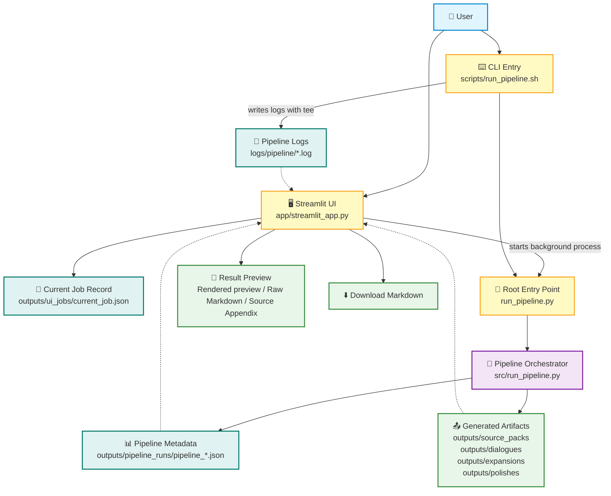
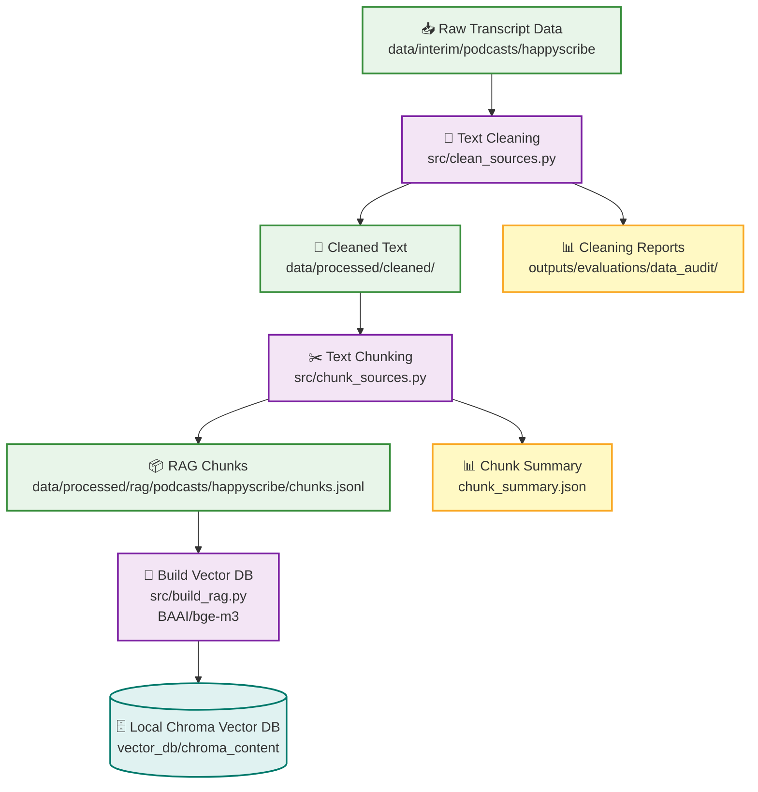
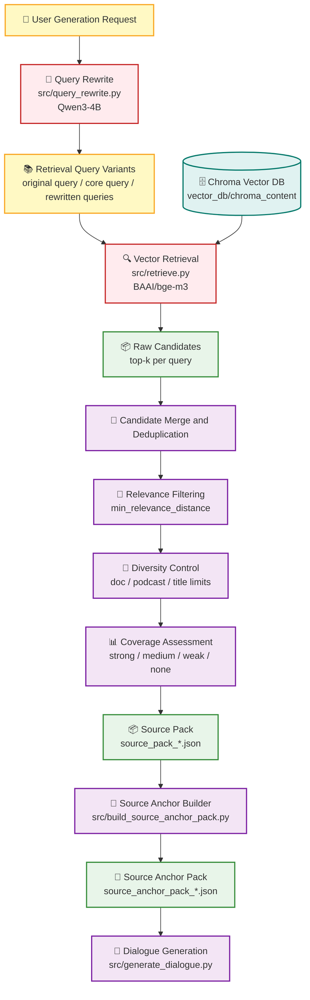
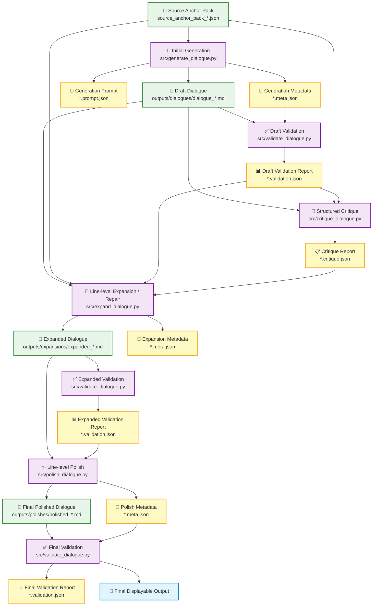
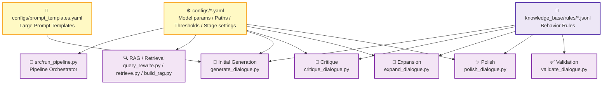
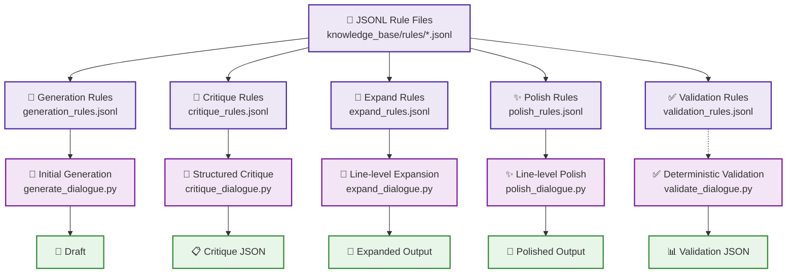

<p align="center">
  <a href="ARCHITECTURE.md">中文</a> | English
</p>

# 🏗️ TTSDataGen System Architecture

This document describes the overall architecture of TTSDataGen V0.2, including runtime entry points, the Streamlit UI job lifecycle, local RAG construction and retrieval, the multi-stage dialogue generation pipeline, validation and metadata handling, and the configuration/rule system.

TTSDataGen is a local-first RAG-to-dialogue generation system. It converts a user topic or generation request into source-grounded, multi-round Chinese A/B dialogue for Text-to-Speech training data generation.

## Table of Contents

- [1. System Overview](#1-system-overview)
- [2. Runtime Entry Points](#2-runtime-entry-points)
- [3. Streamlit UI Job Lifecycle](#3-streamlit-ui-job-lifecycle)
- [4. RAG and Source Preparation Layer](#4-rag-and-source-preparation-layer)
- [5. Dialogue Generation and Multi-stage Improvement Layer](#5-dialogue-generation-and-multi-stage-improvement-layer)
- [6. Validation, Metadata, and UI Recovery](#6-validation-metadata-and-ui-recovery)
- [7. Configuration, Prompt, and Rule System](#7-configuration-prompt-and-rule-system)

---

## 1. System Overview

At a high level, TTSDataGen contains five layers:

```text
User Entry Layer
  → Streamlit UI / CLI

Pipeline Orchestration Layer
  → run_pipeline.py / src/run_pipeline.py

RAG and Source Preparation Layer
  → query rewrite / Chroma retrieval / source pack / source anchor pack

Generation and Improvement Layer
  → generate / validate / critique / expand / polish / final validate

Artifact and Metadata Layer
  → markdown outputs / prompt JSON / validation JSON / pipeline run JSON / logs
```

---

## 2. Runtime Entry Points

TTSDataGen currently provides two main user-facing entry points: the Streamlit UI and the command-line wrapper.

Both entry points call the lightweight root `run_pipeline.py` wrapper, which forwards execution to the canonical pipeline implementation: `src/run_pipeline.py`.

```text
Streamlit UI
  → app/streamlit_app.py

CLI wrapper
  → scripts/run_pipeline.sh

Root Python entry point
  → run_pipeline.py

Canonical Pipeline Orchestrator
  → src/run_pipeline.py
```

### 2.1 Streamlit UI

```text
app/streamlit_app.py
```

The Streamlit UI is the recommended user-facing interface.

It is responsible for:

- collecting the user generation request
- choosing Draft / Full mode
- optionally setting the number of dialogue rounds
- launching the pipeline as a background subprocess
- writing and reading `outputs/ui_jobs/current_job.json`
- tracking the current job PID
- reading `outputs/pipeline_runs/pipeline_*.json`
- displaying task progress, logs, validation status, source quality, and the best available artifact
- allowing the user to cancel a running job
- allowing the user to download the generated Markdown file

The Streamlit UI itself does not directly generate dialogue. It calls the root-level `run_pipeline.py`, which forwards execution to `src.run_pipeline`. The canonical pipeline orchestrator then runs the actual generation workflow.

---

### 2.2 CLI Wrapper

```text
scripts/run_pipeline.sh
```

This shell script is the main terminal entry point. It is useful for development, debugging, and direct command-line pipeline execution.

It is responsible for:

- moving into the project root
- reading the user query
- accepting optional extra instructions
- reading environment variables such as `PIPELINE_MODE`, `PIPELINE_MAX_EXPAND_RETRIES`, `PIPELINE_SKIP_POLISH`, and `PIPELINE_SKIP_EXPAND`
- writing runtime logs to `logs/pipeline/`
- calling the root-level `run_pipeline.py`

Example:

```bash
bash scripts/run_pipeline.sh "生成30轮A与B对话，主题是早餐文化、家庭习惯和代际差异"
```

Draft mode:

```bash
PIPELINE_MODE=draft bash scripts/run_pipeline.sh "生成12轮A与B对话，主题是火车旅行、陌生人和人生选择"
```

Full mode is the default mode:

```bash
PIPELINE_MODE=full bash scripts/run_pipeline.sh "生成30轮A与B对话，主题是厨房气味、童年记忆和家庭聚会"
```

---

### 2.3 Root Python Entry Point

```text
run_pipeline.py
```

The root-level `run_pipeline.py` is intentionally minimal:

```python
from src.run_pipeline import main


if __name__ == "__main__":
    main()
```

Its purpose is to allow both the Streamlit UI and the CLI wrapper to launch the pipeline from the project root without duplicating orchestration logic.

---

### 2.4 Canonical Pipeline Orchestrator

```text
src/run_pipeline.py
```

This is the real workflow engine of the project.

It maintains the full pipeline contract, including:

- creating a stable `run_id`
- planning output paths before stage execution
- writing the initial `pipeline_*.json`
- updating task progress
- running retrieval, source anchor construction, initial generation, validation, critique, expansion, polish, and final validation
- summarizing each stage into `pipeline_meta["stages"]`
- selecting the best available artifact when a run fails or only partially completes
- writing final status, error messages, source quality summary, UI summary, and final output paths

---

### 2.5 Entry Point Architecture



---

## 3. Streamlit UI Job Lifecycle

The Streamlit UI runs the pipeline as a background subprocess instead of blocking the main page thread.

The overall flow is:

```text
User submits a generation request
  → Streamlit creates run_id
  → Streamlit writes current_job.json
  → Streamlit starts run_pipeline.py as a background subprocess
  → src/run_pipeline.py writes pipeline_*.json
  → Streamlit refreshes every few seconds
  → Streamlit reads progress and display_artifact from pipeline_*.json
  → User views progress, logs, validation results, source quality, and final Markdown
```

The current job state is stored in:

```text
outputs/ui_jobs/current_job.json
```

The canonical pipeline state is stored in:

```text
outputs/pipeline_runs/pipeline_*.json
```

This allows the UI to recover the current job state after page refreshes, tab switches, or temporary navigation away from the Streamlit page.

---

### 3.1 UI Recovery Mechanism

The Streamlit UI first reads the current job file:

```text
outputs/ui_jobs/current_job.json
```

This file records:

```text
job_id
run_id
status
pid
query
mode
rounds
extra_instructions
log_path
pipeline_meta_path
```

The UI then reads the corresponding pipeline metadata file:

```text
outputs/pipeline_runs/pipeline_*.json
```

From this file, the UI retrieves:

```text
progress
status
source_quality
display_artifact
ui_summary
stages
final
error
```

If the pipeline has already finished, the UI uses the status stored in `pipeline_meta` rather than relying only on the background process PID.

---

### 3.2 Best Available Artifact Selection

The UI does not guess which file should be displayed.

The Markdown file to display is selected by `src/run_pipeline.py` and written into the `display_artifact` field.

The display priority is:

```text
officially passed final output
  → polished candidate
  → expanded candidate
  → generated draft
  → no displayable artifact
```

This design ensures that even if the Full pipeline does not fully pass final validation, the user can still inspect, download, or manually evaluate an intermediate Markdown artifact when one is available.

---

### 3.3 UI Display Content

The Streamlit UI displays:

- current task ID
- runtime status
- Draft / Full mode
- task progress
- runtime logs
- source quality
- validation results
- current displayed version
- dialogue preview
- raw Markdown
- Source Appendix
- Markdown download button

The dialogue output is split into three views:

```text
Rendered preview
Raw Markdown
Source Appendix
```

This lets users both read the generated dialogue directly and inspect the source appendix or raw markdown structure.

---

## 4. RAG and Source Preparation Layer

The RAG layer in TTSDataGen has two parts:

```text
Offline data build pipeline
  → clean raw text
  → split into RAG chunks
  → generate embeddings
  → write to local Chroma vector database

Runtime retrieval pipeline
  → rewrite user query
  → retrieve relevant chunks from Chroma
  → build source pack
  → select source anchors
  → pass source anchors to dialogue generation
```

This design means that large-scale data processing and vector database construction only need to be completed ahead of time. For each user generation request, the runtime pipeline only needs to run query rewrite, retrieval, and source anchor selection.

---

### 4.1 Offline Data Build Pipeline

The offline data build pipeline converts raw transcript data into a local Chroma vector database that can be searched during generation.



---

### 4.2 Text Cleaning: `src/clean_sources.py`

```text
src/clean_sources.py
```

This module cleans transcript data collected from HappyScribe.

Input:

```text
data/interim/podcasts/happyscribe/<podcast_slug>/source_documents.jsonl
```

Output:

```text
data/processed/cleaned/podcasts/happyscribe/<podcast_slug>/source_documents_clean.jsonl
```

Main responsibilities:

- clean noisy HappyScribe transcript text
- filter documents that are too short after cleaning
- deduplicate by cleaned text hash
- preserve original metadata and cleaning statistics
- write cleaning reports for data quality auditing

Cleaning reports are written to:

```text
outputs/evaluations/data_audit/happyscribe/cleaning/
```

Including:

```text
summary.json
skipped_documents.jsonl
shortest_cleaned_documents.jsonl
largest_reduction_documents.jsonl
podcast_cleaning_counts.jsonl
```

---

### 4.3 Text Chunking: `src/chunk_sources.py`

```text
src/chunk_sources.py
```

This module splits cleaned transcripts into chunks suitable for RAG retrieval.

Input:

```text
data/processed/cleaned/podcasts/happyscribe/
```

Output:

```text
data/processed/rag/podcasts/happyscribe/chunks.jsonl
```

Chunking logic includes:

- detecting timestamp blocks when available
- falling back to paragraph-based splitting when timestamps are not reliable
- controlling chunk length
- supporting block overlap
- merging or filtering chunks that are too short
- writing a stable `chunk_id` for each chunk
- preserving `doc_id`, `podcast_slug`, `title`, `url`, timestamps, character counts, and other metadata
- generating `chunk_content_hash` for later deduplication and auditing

Default chunking parameters:

```text
target_chars = 2800
max_chars = 3600
min_chunk_chars = 400
overlap_blocks = 1
```

This stage also writes a chunk summary for checking chunk counts, length distribution, timestamp-aware document counts, and duplicate chunk hashes.

---

### 4.4 Building the Vector Database: `src/build_rag.py`

```text
src/build_rag.py
```

This module reads `chunks.jsonl`, generates embeddings using a local embedding model, and writes them into a Chroma vector database.

Input:

```text
data/processed/rag/podcasts/happyscribe/chunks.jsonl
```

Output:

```text
vector_db/chroma_content/
```

Main responsibilities:

- read RAG chunks
- generate dense embeddings with `BAAI/bge-m3`
- write to a local Chroma collection
- support batch embedding
- support `max_chunks` and `start_offset`
- skip existing chunk IDs when configured
- support `--reset` to rebuild the collection
- record `total_seen`, `total_added`, `total_skipped_existing`, and `collection_count`

Default vector database settings come from:

```text
configs/rag.yaml
```

Common settings include:

```text
embedding model
batch size
max length
persist_dir
collection_name
distance metric
```

---

### 4.5 Runtime Retrieval Pipeline

The runtime retrieval pipeline runs after the user submits a generation request.

It does not rebuild the vector database. Instead, it uses the already prepared Chroma database for retrieval.



---

### 4.6 Query Rewrite: `src/query_rewrite.py`

```text
src/query_rewrite.py
```

This module rewrites user input into retrieval-friendly queries for local RAG.

Its goal is not to generate final dialogue content. Its goal is to help the system retrieve more relevant source chunks from the local podcast transcript database.

Output structure:

```json
{
  "canonical_terms": [],
  "core_query": "",
  "retrieval_queries": [],
  "rewrite_used": true
}
```

Main design points:

- uses LM Studio with local Qwen3-4B
- converts Chinese or mixed-language requests into English retrieval queries
- separates content topic from output-format instructions
- avoids putting instructions such as “generate a 30-round dialogue” into retrieval queries
- uses a topic consistency sanitizer to reduce query rewrite drift
- supports query rewrite cache
- falls back to the original user query if rewriting fails

The cache is written by default to:

```text
outputs/source_packs/query_rewrite_cache.jsonl
```

---

### 4.7 Source Pack: `src/retrieve.py`

```text
src/retrieve.py
```

This module retrieves source chunks from the local Chroma vector database and writes a source pack.

A source pack contains:

```text
user_query
query_rewrite
retrieval_params
coverage
sources
```

Each item in `sources` preserves:

```text
rank
distance
chunk_id
doc_id
title
podcast_slug
url
timestamp
chunk_index
matched_queries
text
```

This stage also performs:

- multi-query retrieval
- raw top-k retrieval
- duplicate candidate merging
- content hash deduplication
- per-doc / per-podcast / per-title limits
- relevance threshold filtering
- coverage assessment

The source pack is the input to source anchor selection.

---

### 4.8 Source Anchor Pack: `src/build_source_anchor_pack.py`

```text
src/build_source_anchor_pack.py
```

This module converts a source pack into a more compact source anchor pack that is more suitable for generation prompts.

It does not simply put all retrieved chunks into the prompt. Instead, it:

- builds a query profile from the user query and query rewrite output
- separates strong terms, support terms, and weak terms
- identifies topic axes
- cleans ads, promos, and podcast noise from source text
- scores sentences using topic evidence
- selects relevant excerpts at the sentence level
- infers anchor roles: `core`, `supporting`, or `context`
- rejects weak, ad-like, noisy, or insufficiently grounded sources
- applies a diversity filter to reduce repetition from the same document or podcast
- outputs selected anchors, unused accepted candidates, and rejected candidates

Output files:

```text
outputs/source_packs/source_anchor_pack_*.json
outputs/source_packs/latest_source_anchor_pack.json
```

The Source Anchor Pack is the main source material used by the generation stage.

Its goal is to reduce prompt noise and help `generate_dialogue.py` prioritize more reliable, concrete, and topic-relevant material.

---

### 4.9 RAG Module Responsibility Table

| Module | Type | Main Responsibility | Typical Output |
|---|---|---|---|
| `src/clean_sources.py` | Offline data processing | Clean transcripts, deduplicate, filter short content, and write audit reports | `source_documents_clean.jsonl` |
| `src/chunk_sources.py` | Offline data processing | Split cleaned transcripts into RAG chunks while preserving metadata | `chunks.jsonl` |
| `src/build_rag.py` | Offline vector database build | Generate embeddings with BGE-M3 and write them to Chroma | `vector_db/chroma_content/` |
| `src/query_rewrite.py` | Runtime retrieval preparation | Rewrite user requests into retrieval queries and reduce topic drift | `query_rewrite` object |
| `src/retrieve.py` | Runtime retrieval | Retrieve source chunks from Chroma, deduplicate, filter, and assess coverage | `source_pack_*.json` |
| `src/build_source_anchor_pack.py` | Runtime source compression | Select high-value source anchors from the source pack | `source_anchor_pack_*.json` |

---

## 5. Dialogue Generation and Multi-stage Improvement Layer

The generation layer in TTSDataGen does not rely on a single LLM call to solve everything. Instead, it separates generation, checking, critique, expansion, and polish into multiple stages with clear responsibilities.

Overall flow:

```text
Source Anchor Pack
  → initial generation
  → draft validation
  → structured critique
  → line-level expansion
  → expanded validation
  → line-level polish
  → final validation
```

Each module is responsible for a specific type of problem:

```text
generate_dialogue.py    → generate a source-grounded draft
validate_dialogue.py    → run deterministic structure and quality checks
critique_dialogue.py    → identify content, structure, source usage, and style issues
expand_dialogue.py      → expand weak lines and repair critique-identified problems
polish_dialogue.py      → locally polish Chinese expression without adding facts
validate_dialogue.py    → confirm that the final output is usable
```

---

### 5.1 Generation and Improvement Architecture



---

### 5.2 Initial Generation: `src/generate_dialogue.py`

```text
src/generate_dialogue.py
```

This module generates the first A/B dialogue draft from a `source_anchor_pack`.

Input:

```text
source_pack_*.json
source_anchor_pack_*.json
configs/generation.yaml
configs/prompt_templates.yaml
knowledge_base/rules/generation_rules.jsonl
```

Output:

```text
outputs/dialogues/dialogue_*.md
outputs/dialogues/dialogue_*.meta.json
outputs/dialogues/dialogue_*.prompt.json
```

Main responsibilities:

- read `source_pack` and `source_anchor_pack`
- validate that the source anchor pack contains usable anchors
- check that the source pack and source anchor pack match the current query
- infer the number of rounds from the user query
- load generation rules
- build the generation quality contract
- compress source anchors into a prompt-friendly format
- call the local model through LM Studio
- remove any model-generated source notes
- deterministically append the `Source Appendix`
- write the dialogue markdown, prompt JSON, and metadata JSON

The `Source Appendix` is not freely generated by the model. It is deterministically written by Python from the source anchor pack. This reduces the risk of fabricated citations or source information in the dialogue body.

---

### 5.3 Deterministic Validation: `src/validate_dialogue.py`

```text
src/validate_dialogue.py
```

This module does not call an LLM. It performs deterministic checks on the Markdown output.

It checks:

```text
round count
A/B line count
whether line numbers are contiguous
whether A/B speakers alternate correctly
whether Round headings match dialogue lines
whether Source Appendix exists
whether the dialogue body leaks source / retrieval / metadata information
whether duplicate dialogue lines exist
short-line ratio
developed-line ratio
```

Default quality thresholds:

```text
short_line_chars = 50
developed_line_chars = 90
max_short_line_ratio = 0.35
min_developed_line_ratio = 0.50
```

The validation result separates two layers:

```text
mechanical_passed
  → whether format, numbering, A/B structure, Source Appendix, and leakage checks pass

quality_passed
  → whether density and repetition checks pass on top of mechanical_passed
```

Therefore:

```text
passed = mechanical_passed
quality_passed = mechanical_passed with no quality-blocking warnings
needs_rewrite = mechanical_passed but has quality-blocking warnings
```

This allows the pipeline to distinguish between “the structure is broken” and “the structure is valid, but the content still needs expansion.”

---

### 5.4 Structured Critique: `src/critique_dialogue.py`

```text
src/critique_dialogue.py
```

This module critiques the draft but does not rewrite the dialogue.

Input:

```text
dialogue markdown
source_anchor_pack_*.json
validation report
configs/critic.yaml
knowledge_base/rules/critique_rules.jsonl
```

Output:

```text
dialogue_*.critique.json
dialogue_*.critique.prompt.json
```

Main responsibilities:

- split dialogue body and Source Appendix
- slim the validation report
- slim the source anchor pack
- load critique rules
- build a strict-JSON critique prompt
- call the local model through LM Studio
- parse the critique JSON returned by the model
- write a fallback parse error report if the model returns invalid JSON

The critique result includes:

```text
overall_score
ready_for_rewrite
mechanical_status
quality_status
source_usage
dialogue_quality
major_issues
rewrite_priorities
rewrite_constraints
```

The goal of this stage is not to make the text sound better directly. Its purpose is to provide clear repair instructions for `expand_dialogue.py`.

---

### 5.5 Line-level Expansion and Repair: `src/expand_dialogue.py`

```text
src/expand_dialogue.py
```

This is the main quality-improvement stage. It does not rewrite the whole dialogue. Instead, it selects speaker lines that need expansion or repair based on validation and critique results.

Input:

```text
dialogue markdown
source_anchor_pack_*.json
validation report
critique report
configs/expander.yaml
knowledge_base/rules/expand_rules.jsonl
```

Output:

```text
outputs/expansions/expanded_*.md
outputs/expansions/expanded_*.meta.json
outputs/expansions/expanded_*.prompt.json
```

Main responsibilities:

- parse numbered A/B speaker lines
- use the validation report to identify lines below the developed threshold
- use the critique report to identify content that needs repair
- exclude source anchors marked by the critic as awkward / forced / off-context
- send target speaker lines to the local model in batches
- require the model to return JSON replacements only
- replace only specified lines without adding, deleting, merging, splitting, or reordering lines
- sanitize replacements and apply length checks
- preserve or regenerate the Source Appendix
- write the expanded result and detailed batch metadata

Expansion stage boundaries:

```text
can increase content density
can add source-grounded details
can repair critique-identified issues
cannot change A/B numbering structure
cannot leak source / anchor / retrieval information
cannot turn the dialogue into expository prose
```

---

### 5.6 Line-level Polish: `src/polish_dialogue.py`

```text
src/polish_dialogue.py
```

This module performs final Chinese expression polishing. It is a source-free stage: it does not read source anchors and should not add new facts.

Input:

```text
expanded dialogue markdown
validation report
configs/polisher.yaml
knowledge_base/rules/polish_rules.jsonl
```

Output:

```text
outputs/polishes/polished_*.md
outputs/polishes/polished_*.meta.json
outputs/polishes/polished_*.prompt.json
```

Main responsibilities:

- parse the dialogue body and Source Appendix
- parse numbered A/B speaker lines
- load polish rules
- polish speaker lines in batches
- require the model to return JSON replacements only
- replace only lines that need polishing
- preserve line numbers, speaker labels, and overall structure
- use length guards to prevent excessive shortening or expansion
- preserve the original Source Appendix
- write polished markdown and metadata

Polish stage boundaries:

```text
can improve Chinese fluency
can reduce translation-like phrasing
can reduce repetitive openings
can improve readability for spoken delivery
cannot add new facts
cannot introduce new sources
cannot perform source-grounded expansion
cannot change dialogue structure
```

---

### 5.7 Module Responsibility Table

| Module | Stage Type | Calls LLM | Uses Source Anchors | Modifies Dialogue | Main Output |
|---|---|---:|---:|---:|---|
| `src/generate_dialogue.py` | Initial generation | Yes | Yes | Generates full dialogue | `outputs/dialogues/dialogue_*.md` |
| `src/validate_dialogue.py` | Deterministic validation | No | No | No | `*.validation.json` |
| `src/critique_dialogue.py` | Structured critique | Yes | Yes | No | `*.critique.json` |
| `src/expand_dialogue.py` | Line-level expansion / repair | Yes | Yes | Yes, by line replacement | `outputs/expansions/expanded_*.md` |
| `src/polish_dialogue.py` | Line-level polish | Yes | No | Yes, by line replacement | `outputs/polishes/polished_*.md` |
| `src/validate_dialogue.py` | Final validation | No | No | No | `*.validation.json` |

---

### 5.8 Why the Pipeline Is Split into Multiple Stages

This multi-stage design has several benefits:

1. **Generation and repair are separated**  
   Initial generation focuses on turning source anchors into a complete A/B dialogue. It does not need to solve every quality issue in one pass.

2. **Quality issues become easier to locate**  
   Validation handles mechanical structure and content density checks. Critique handles more semantic quality diagnosis.

3. **Expansion is more controllable**  
   Expansion only edits target lines instead of rewriting the entire dialogue, which makes it easier to preserve round count, numbering, and A/B structure.

4. **Polish does not contaminate facts**  
   Polish is a source-free stage that only performs local expression-level edits. It does not add facts or introduce external information.

5. **Every stage leaves artifacts**  
   Each stage writes `.md`, `.meta.json`, `.prompt.json`, or `.validation.json` files, which makes debugging, tracing, and UI display easier.

---

## 6. Validation, Metadata, and UI Recovery

TTSDataGen writes structured metadata at every key stage to support debugging, recovery, and UI display.

The main runtime record is:

```text
outputs/pipeline_runs/pipeline_*.json
```

This file records:

```text
pipeline status
progress
config paths
output paths
stage summaries
validation summaries
critique summaries
source quality summary
display artifact
ui summary
final result
error message
```

---

### 6.1 Two-layer Validation Result

`src/validate_dialogue.py` separates validation results into two layers:

```text
mechanical_passed
quality_passed
```

Where:

```text
mechanical_passed
  → whether structural errors exist, such as wrong round count, incorrect A/B numbering, speaker alternation errors, missing Source Appendix, or source/retrieval leakage in the dialogue body

quality_passed
  → whether content density and repetition checks also pass on top of mechanical_passed
```

A dialogue can therefore have one of three states:

```text
failed_mechanical
  → structural errors exist, so the output is usually not usable

needs_rewrite
  → structure is valid, but density or repetition is insufficient, so expansion or repair is needed

passed
  → both structure and quality checks pass
```

---

### 6.2 Pipeline Metadata

Each pipeline run writes:

```text
outputs/pipeline_runs/pipeline_*.json
```

This is the core state file used by the Streamlit UI and command-line debugging.

Common fields include:

```text
run_id
query
mode
status
progress
paths
stages
source_quality
display_artifact
ui_summary
final
error
started_at
finished_at
```

---

### 6.3 Best Available Artifact

Even when the Full pipeline does not completely succeed, the system tries to select the best available artifact for the UI.

Priority:

```text
officially passed final polished output
  → polished candidate
  → expanded candidate
  → generated draft
  → no displayable artifact
```

This means the Streamlit UI does not need to guess which file to display. It only needs to read `pipeline_meta["display_artifact"]`.

---

### 6.4 Why Metadata Matters

These metadata files are used for:

- restoring tasks after page refresh
- tracking background job status
- showing current progress
- displaying logs and errors
- deciding whether the final result can be downloaded
- evaluating source matching quality
- comparing generated / expanded / polished stages
- debugging prompts, rules, and validation thresholds

---

## 7. Configuration, Prompt, and Rule System

TTSDataGen keeps model parameters, prompt templates, and behavior rules outside the core Python logic as much as possible.

The goal is:

```text
Python code controls workflow and structure
configs/*.yaml controls model parameters, paths, and stage settings
prompt_templates.yaml controls large prompt templates
knowledge_base/rules/*.jsonl controls behavior rules that can be iterated over time
```

This design avoids frequent modification of core code and makes it easier to tune different stage behaviors based on generated results.

---

### 7.1 Configuration System Overview



---

### 7.2 Config Files

Configuration files are located under:

```text
configs/
```

Main files include:

| File | Purpose | Main Controls |
|---|---|---|
| `configs/rag.yaml` | RAG and retrieval configuration | embedding model, Chroma path, collection name, query rewrite, top-k, distance threshold, diversity limits |
| `configs/generation.yaml` | initial generation configuration | generator model, source anchor thresholds, default rounds, output directory, generation rule path |
| `configs/critic.yaml` | critique configuration | critic model, temperature, max tokens, critique rule path |
| `configs/expander.yaml` | expansion configuration | expander model, output directory, expand rules, expansion prompt boundaries |
| `configs/polisher.yaml` | polish configuration | polisher model, output directory, polish rules, polish prompt boundaries |
| `configs/prompt_templates.yaml` | prompt templates | large system prompt and user template for initial generation |

These configuration files mainly control:

```text
model names
LM Studio API address
temperature / top_p / max_tokens
input and output paths
RAG retrieval parameters
Source Anchor selection thresholds
which rules are loaded for each stage
prompt template paths
```

---

### 7.3 RAG Configuration: `configs/rag.yaml`

```text
configs/rag.yaml
```

This file controls the local RAG system, including:

```text
embedding:
  model_name
  batch_size
  max_length
  use_fp16

chroma:
  persist_dir
  collection_name
  distance_metric

query_rewrite:
  enabled
  model
  max_queries
  cache_path

retrieval:
  raw_top_k_per_query
  final_top_k
  max_chunks_per_doc
  max_chunks_per_podcast
  max_chunks_per_title
  min_relevance_distance
```

It is mainly used by:

```text
src/query_rewrite.py
src/retrieve.py
src/build_rag.py
```

Note that `query_rewrite.model` must match the model ID actually loaded in LM Studio.

For example, if LM Studio displays `qwen3-4b`, but the config says `qwen/qwen3-4b`, the config should be adjusted to match the actual LM Studio model ID.

---

### 7.4 Generation Configuration: `configs/generation.yaml`

```text
configs/generation.yaml
```

This file controls initial generation and Source Anchor Pack behavior.

It contains several important configuration groups:

```text
generator
source_anchors
dialogue
prompt_templates
rules.generation
```

Where:

```text
generator
```

controls the local generation model, for example:

```text
model
temperature
top_p
max_tokens
timeout_seconds
```

```text
source_anchors
```

controls source anchor selection, for example:

```text
max_sources
max_anchors
min_sentence_score
min_anchor_score
min_core_anchor_score
drop_noise
drop_ads
enable_diversity_filter
max_anchors_per_doc_id
max_anchors_per_podcast_slug
```

```text
dialogue
```

controls the default dialogue format, for example:

```text
default_rounds
language
speaker_a
speaker_b
output_dir
source_appendix_excerpt_chars
```

```text
rules.generation
```

controls which rule file is loaded by the generation stage, for example:

```text
knowledge_base/rules/generation_rules.jsonl
```

---

### 7.5 Stage Configuration: Critic / Expander / Polisher

These three configuration files control the post-generation stages:

```text
configs/critic.yaml
configs/expander.yaml
configs/polisher.yaml
```

They are structurally similar and mainly include:

```text
model parameters
output directory
corresponding stage rule path
prompt template or prompt boundary
```

Mapping:

| Config File | Module | Rule File |
|---|---|---|
| `configs/critic.yaml` | `src/critique_dialogue.py` | `knowledge_base/rules/critique_rules.jsonl` |
| `configs/expander.yaml` | `src/expand_dialogue.py` | `knowledge_base/rules/expand_rules.jsonl` |
| `configs/polisher.yaml` | `src/polish_dialogue.py` | `knowledge_base/rules/polish_rules.jsonl` |

Where:

```text
critic
```

generates structured critique and does not directly rewrite the text.

```text
expander
```

performs source-aware line-level expansion using source anchors.

```text
polisher
```

performs source-free line-level polish and only makes local expression-level edits without adding new facts.

---

### 7.6 Prompt Templates

```text
configs/prompt_templates.yaml
```

This file stores large prompt templates, especially the template used by the initial generation stage.

The main pipeline currently uses:

```text
source_anchor_generation
```

It defines:

```text
system prompt
user_template
```

and instructs the model on how to convert `source_anchor_pack` into a natural, content-dense Chinese A/B dialogue.

Note:

```text
brief
generation
```

These two groups are more legacy / fallback-oriented. The current main pipeline should prioritize `source_anchor_generation`.

---

### 7.7 Rule Files

Rule files are located under:

```text
knowledge_base/rules/
```

Main files include:

```text
generation_rules.jsonl
critique_rules.jsonl
expand_rules.jsonl
polish_rules.jsonl
validation_rules.jsonl
```

These JSONL files are not ordinary documentation. They are the behavior control layer for each pipeline stage.

Each line usually represents one rule and contains:

```json
{
  "rule_id": "rule ID",
  "status": "active",
  "priority": 100,
  "category": "rule category",
  "rule": "human-readable rule summary",
  "prompt_instruction": "the concrete instruction inserted into the prompt"
}
```

Where:

```text
status
  → whether the rule is enabled

priority
  → rule priority; higher values are loaded earlier

category
  → rule category for grouping and debugging

rule
  → human-readable rule summary

prompt_instruction
  → the concrete instruction injected into the model prompt
```

---

### 7.8 Rule System Architecture



---

### 7.9 Generation Rules

```text
knowledge_base/rules/generation_rules.jsonl
```

Generation rules control the initial generation stage.

The core goal of this stage is:

```text
Generate a complete, usable, content-dense, source-grounded Chinese A/B dialogue draft.
```

Main rule categories:

| Category | Purpose |
|---|---|
| `multi_source_grounding` | require the draft to be grounded in cleaned retrieved source excerpts instead of free-form topic writing |
| `source_coverage` | require core source excerpts to be clearly used, while supporting excerpts are used only when helpful |
| `source_density` | require most substantive turns to preserve or develop concrete source details |
| `turn_depth` | avoid short-line exchanges and generate longer speaker lines suitable for TTS training |
| `controlled_expansion` | allow moderate expansion, but only when it grows from retrieved source excerpts |
| `dialogue_naturalness` | make A/B sound like a real dialogue rather than alternating encyclopedia paragraphs |
| `format` | enforce strict Round and A/B numbering format |
| `private_context` | forbid speaker lines from mentioning source, anchor, retrieval, metadata, URLs, or other internal information |
| `generation_first` | prioritize producing a usable draft instead of over-optimizing fine-grained style in the generation stage |

Boundary of generation rules:

```text
They control source grounding, content density, structural completeness, and basic dialogue feel.
They do not handle fine-grained polish or solve every style problem in a single stage.
```

---

### 7.10 Critique Rules

```text
knowledge_base/rules/critique_rules.jsonl
```

Critique rules control the critique stage.

This stage does not rewrite the dialogue. It outputs structured JSON critique that tells the expansion stage what should be repaired.

Main rule categories:

| Category | Purpose |
|---|---|
| `density` | identify content that is too short, thin, or outline-like |
| `repetition` | identify repeated sentence frames, repeated points, and circular phrasing |
| `progression` | check whether the dialogue develops across rounds instead of staying in place |
| `source_usage` | check whether core anchors are used and whether supporting anchors are forced |
| `generic_drift` | identify generic discussion that drifts away from source anchors |
| `naturalness` | check whether the dialogue sounds like a real exchange or an over-explanatory lecture |
| `speaker_balance` | check whether both A and B contribute content instead of A explaining and B merely agreeing |
| `rewrite_constraints` | require downstream repair to preserve round count, numbering, A/B structure, and source privacy boundaries |

Critique output affects:

```text
expand_dialogue.py
```

Especially fields such as:

```text
major_issues
rewrite_priorities
rewrite_constraints
awkward_or_forced_anchor_ids
unsupported_or_generic_expansion
```

These fields are read by the expansion stage to decide what needs repair and which source anchors should no longer be used.

---

### 7.11 Expand Rules

```text
knowledge_base/rules/expand_rules.jsonl
```

Expand rules control the line-level expansion stage.

The core goal of this stage is:

```text
Without changing dialogue structure, expand weak speaker lines into more developed, concrete, source-grounded turns.
```

Main rule categories:

| Category | Purpose |
|---|---|
| `format` | replace only selected numbered speaker lines; do not add, delete, merge, or split lines |
| `density` | expand thin lines into more developed turns |
| `source_grounding` | privately use source anchors to add concrete details without mentioning sources in the dialogue body |
| `critic_repair` | repair major issues identified by the critique report |
| `progression` | ensure each expanded line moves the dialogue forward |
| `naturalness` | keep expanded content conversational rather than expository |
| `stage_boundary` | avoid fine-grained style polish during the expansion stage |
| `unsupported_expansion` | forbid unsupported new examples, studies, facts, or topic-specific assumptions |

Expansion boundaries:

```text
can expand
can add source-grounded content
can repair critique-identified issues
cannot change line numbers, speakers, round count, or order
cannot leak source / anchor / retrieval information
cannot add unsupported facts
```

---

### 7.12 Polish Rules

```text
knowledge_base/rules/polish_rules.jsonl
```

Polish rules control the final expression polishing stage.

This stage is:

```text
source-free line-level polish
```

This means the polish stage no longer uses source anchors and should not add new facts.

Main rule categories:

| Category | Purpose |
|---|---|
| `format` | preserve line numbers, speakers, Round headings, and overall structure |
| `content_preservation` | preserve original meaning, major details, and local dialogue function |
| `stage_boundary` | apply only active polish rules; do not perform new content expansion |
| `naturalness` | reduce repetitive agreement openings such as “是啊 / 对啊 / 确实 / 没错” |
| `language_naturalness` | reduce translation-like or stiff written phrasing |
| `readability` | improve readability for spoken Chinese delivery |
| `speaker_balance` | prevent speaker B from always starting with agreement before adding content |
| `no_source_leakage` | ensure the polish stage does not introduce source, anchor, retrieval, or other internal terms |
| `generality` | avoid rules hardcoded for one specific topic |

Polish boundaries:

```text
can improve Chinese expression
can reduce repetitive openings
can improve spoken readability
can make local sentence-level edits
cannot add new facts
cannot introduce new examples
cannot continue source-grounded expansion
cannot change dialogue structure
```

---

### 7.13 Validation Rules

```text
knowledge_base/rules/validation_rules.jsonl
```

Validation rules record checks that the validator should care about, for example:

| Rule ID | Validator Check | Purpose |
|---|---|---|
| `val_format_001` | `check_round_count` | check dialogue round count |
| `val_format_002` | `check_numbered_lines` | check the number of numbered dialogue lines |
| `val_format_003` | `check_ab_alternation` | check strict A/B alternation |
| `val_style_001` | `count_agreement_openers` | count repeated agreement openings |
| `val_depth_001` | `turn_length_distribution` | check whether speaker turns are too short |

Current note:

```text
src/validate_dialogue.py is the main deterministic validation implementation.
validation_rules.jsonl is closer to a validation rule registry and future extension interface.
```

In other words, validation is currently mainly executed by Python code, not freely judged by an LLM using validation rules.

---

### 7.14 Responsibility Boundaries Across Rule Files

| File | Stage | Main Problem It Solves | What It Should Not Solve |
|---|---|---|---|
| `generation_rules.jsonl` | initial generation | source grounding, content density, structural completeness, basic dialogue feel | fine-grained polish; solving every style issue in one pass |
| `critique_rules.jsonl` | critique | identify thin content, repetition, generic drift, poor source usage, and speaker imbalance | directly rewriting the dialogue body |
| `expand_rules.jsonl` | expansion | expand short lines, add source-grounded details, repair critique-identified issues | changing structure or doing purely surface-level polish |
| `polish_rules.jsonl` | polish | improve Chinese naturalness, reduce repetitive openings, improve spoken readability | adding facts or continuing expansion |
| `validation_rules.jsonl` | validation registry | record checks that the validator should care about | replacing deterministic logic in `validate_dialogue.py` |

---

### 7.15 Why Rules Are Split by Stage

TTSDataGen does not put all rules into one large prompt. Instead, rules are split by stage.

Reasons:

1. **Reduce rule conflicts**  
   For example, expansion needs to “add content,” while polish needs to “avoid adding facts.” If they are mixed together, the model may not know which priority to follow.

2. **Keep stage boundaries clear**  
   Generation writes the draft. Critique diagnoses issues. Expansion deepens content. Polish improves expression. Validation performs mechanical checks.

3. **Make debugging easier**  
   Each stage records loaded rule IDs in prompt JSON or metadata, making it easier to inspect which rules influenced a specific output.

4. **Enable iterative improvement**  
   If a recurring issue appears, only the corresponding JSONL rule file needs to be changed. The core pipeline code does not need to be rewritten.

5. **Preserve generality**  
   Rules describe general generation behavior rather than hardcoding one specific topic. This helps the project adapt to different user requests.
